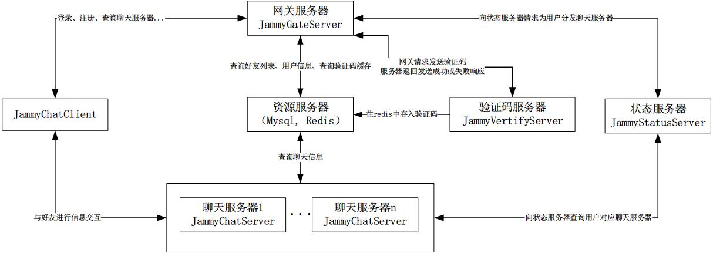
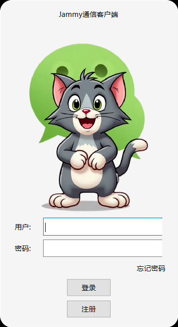
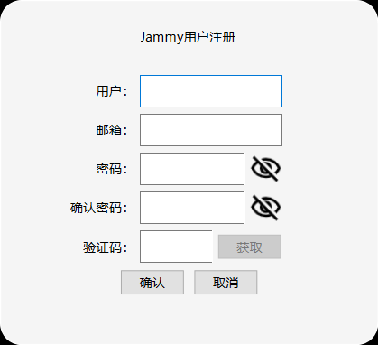
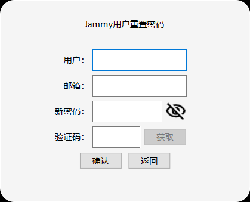
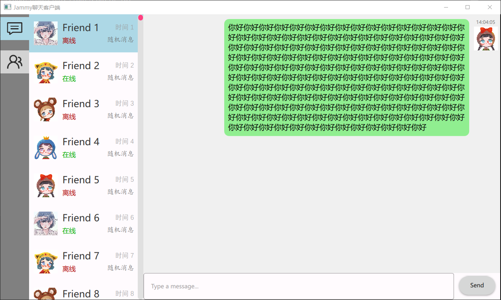

# 项目概述
JammyChat是一个及时聊天通信软件，使用QWidget和QML混合开发，并与后端服务器进行通信，其中登录、注册、密码重置模块使用QWidget进行界面设计，主体聊天界面使用QML，主体结构设计如下。

- 客户端：主体聊天框架采用QT6+QML进行界面开发，使用model-base进行界面开发，并将model开放给c++端，c++端仅做与服务端的数据交互，做到了MVC三者分离。
- [网关服务器](https://github.com/jammy-6/JammyGateServer)：承担客户端的连接和注册、登录请求处理。其采用分布式负载均衡结构，将客户端请求均匀分配到多个服务器节点上，避免单点服务器过载。
- [验证码发送服务器](https://github.com/jammy-6/JammyVertifyServer)：用于验证和收发邮件，在用户注册、找回密码等场景中发挥重要作用，如向用户发送注册验证码、密码重置链接等邮件。
- [状态服务器](https://github.com/jammy-6/JammyStatusServer)：主要保存登录用户对应的聊天服务器信息，即uid:chatServerIP，负责监听其他服务器的查询请求，例如查询服务器状态、在线用户数量等信息，以便系统管理员进行监控和管理。
- [聊天服务器](https://github.com/jammy-6/JammyChatServer)：负责客户端之间的消息转发，通过 asio 实现 tcp 可靠长连接通信和转发，确保消息准确无误地在用户之间传递。

# 技术要点
- 客户端：PC 客户端为用户提供聊天界面和交互功能，通过与服务器建立连接，实现用户注册、登录、消息发送和接收等操作。
- 服务端
  - gRPC通信：各服务间采用 gRPC 进行通信，gRPC 是一种高性能、开源的通用 RPC 框架，能够实现高效的服务间调用。
  例如，GateServer 调用 VarifyServer 验证注册合理性时，通过 gRPC 可以快速传递请求和获取响应，保证注册流程的高效性。
  - HTTP 网关（beast 网络库）：利用 beast 网络库搭建 http 网关，方便客户端与服务器之间的通信。客户端可以通过 HTTP 协议与网关进行交互，网关再将请求转发到相应的服务器处理。
  比如客户端发送注册请求时，先到达 http 网关，网关再根据请求类型将其路由到 GateServer 进行注册处理。
  - 数据存储与操作：分别实现了redis、grpc 和 mysql 的连接池，有效管理和复用数据库连接资源，减少连接创建和销毁的开销。在频繁的数据库操作场景中，如用户登录验证（查询 mysql 用户表）、聊天记录存储（可能涉及 redis 或 mysql）等，连接池可以快速提供可用连接，提高系统性能。
  - Redis 操作类封装：手动封装了 redis 操作类，简化了 hredis 的调用操作，方便在项目中对 redis 进行各种数据操作，如存储用户会话信息、缓存聊天记录等。

# 主体界面展示
用户登录、注册、重置密码界面如下

  
  
  

  
用户主体聊天界面如下
  

# 开发环境与技术栈
项目采用CMake进行编译构建，使用的boost::beast网络库，nlohmann::josn，QT6，gRPC等技术，数据库方面使用了Mysql8.0 c++ connector连接库、hiredis库等。
